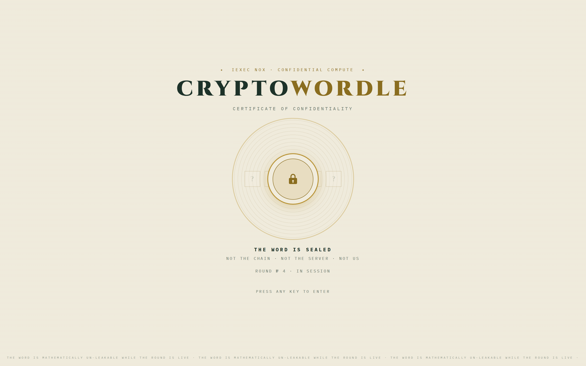
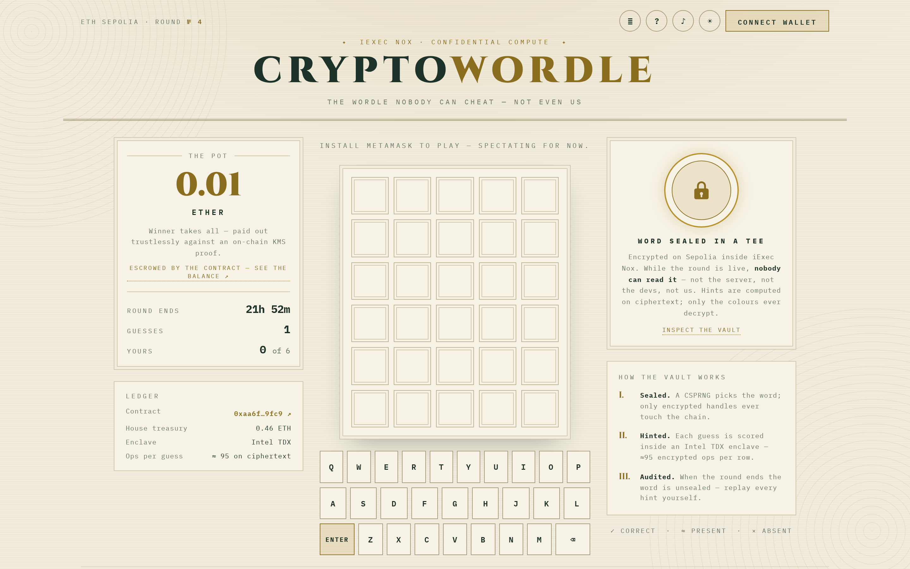

# CryptoWordle

**A Wordle nobody can cheat — not even us.**

**▶ Play it live: <https://raorla.github.io/CRYPTOWORDLE/>** — ETH Sepolia; spectating needs no wallet, playing needs MetaMask with Sepolia ETH.





The secret five-letter word lives on ETH Sepolia as five encrypted handles inside [iExec Nox](https://docs.iex.ec/), a TEE-based confidential compute layer (Intel TDX — not FHE). While a round is open, the *only* principal with access to those handles is the game contract itself. Not the server that created the round. Not the people who wrote this code. Not the players. Nobody on Earth can read the word — yet every guess gets its green/yellow/grey hints computed **on ciphertext**, and when someone wins, the pot pays out **trustlessly**, settled by a KMS decryption proof verified on-chain.

When the round ends, the word is revealed publicly so anyone can check that every hint handed out was honest. Provable fairness, end to end.

- 16/16 integration tests passing against the **real** local Nox stack (KMS + gateway + TDX runner in Docker) — no mocks anywhere.
- Trustless claims: anyone can crank `claim()`; the pot always pays the player who made the winning guess.
- Un-leakability is *asserted in tests*, not just promised: the ACL of every secret-letter handle is checked on the NoxCompute contract.
- The frontend closes the loop: when a round ends, it **replays every hint it was given against the revealed word, client-side** (`frontend/src/audit.ts`) and stamps the verdict on screen — provable fairness you can watch happen.

---

## Verify every claim yourself (reviewers — human or AI — start here)

Nothing in this README asks for trust. Each claim maps to something you can run, read, or click:

| Claim | Where it's proven |
|-------|-------------------|
| The secret is un-leakable while a round is Open | `npm test` → *"keeps the secret mathematically un-leakable while the round is Open"* — asserts `isAllowed`/`isViewer`/`isPubliclyDecryptable` on the NoxCompute contract for every secret handle ([test/integration/cryptowordle.test.ts](test/integration/cryptowordle.test.ts)) |
| Hints are computed on ciphertext; only colors ever decrypt | `npm test` → *"computes Wordle colors on ciphertext — only colors come out"* |
| Settlement is trustless; forged proofs revert | `npm test` → *"detects the winning guess and pays the pot trustlessly via KMS proof"* and *"rejects claims backed by a losing guess or a forged proof"* |
| Every hint handed out was honest | Post-round reveal + client-side replay: [frontend/src/audit.ts](frontend/src/audit.ts) re-scores every guess against the unsealed word with the exact contract semantics (pinned in [frontend/src/audit.test.ts](frontend/src/audit.test.ts), duplicate-letter rule included) |
| The pot money is real and escrowed on-chain | [Blockscout balance + Read Contract](https://eth-sepolia.blockscout.com/address/0xaa6f76b4dc7d2df17ff73c7162523f0985289fc9) · invariant `balance == treasury + Σ open pots` pinned by `npm test` → *"opens rounds from the treasury and keeps the balance invariant"* ([test/integration/treasury.test.ts](test/integration/treasury.test.ts)) |
| It runs on the live testnet, end to end | Linked create → guess → claim → reveal transactions in [Deployed addresses](#deployed-addresses-eth-sepolia) below, plus `npm run sanity:sepolia` to reproduce the whole loop yourself |

No Docker handy? The fast tiers run in seconds: `npm run test:unit` (7) and `cd frontend && npm test` (55, Vitest) — the integration suite (16 tests against the real KMS/TEE stack in Docker) takes a few minutes. The [Project layout](#project-layout) table below maps every path to its role.

---

## How the privacy guarantee works

Follow the word on its journey:

1. **Pick.** The round generator draws a word with a CSPRNG (`node:crypto.randomInt`) from 1,500 curated answers (Knuth's Stanford GraphBase five-letter list, public domain). It never logs it, never writes it to disk.
2. **Seal.** Each letter (encoded 0–25) is encrypted via `encryptInput` over attested TLS to the Nox handle gateway (itself a TEE). What comes back is five opaque 32-byte **handles** plus input proofs. The plaintext variable goes out of scope. Gone.
3. **Lock.** `createRound` validates the proofs on-chain and grants access with `Nox.allowThis` **only** — the contract is the sole principal on the ACL. No viewer, no admin, no public decryption. You can audit this yourself: `getSecretHandles(roundId)` returns the handles, and `isPubliclyDecryptable` / `isAllowed` / `isViewer` on the NoxCompute contract must all say *no* for everyone except the game contract. Our test suite asserts exactly that.
4. **Play.** Guesses are public letters in calldata (you typed them; they were never secret). For each guess the contract emits ~95 encrypted operations (`eq`/`select`/`add`/`gt`) that the Nox runner executes on plaintext **inside an Intel TDX enclave**. Per-letter colors (0 grey, 1 yellow, 2 green) and a win flag are the only values marked publicly decryptable. A row sums to 10 if and only if all five letters are green (the best a non-winning row can do is 9), so `colorSum == 10 ⇔ win`.
5. **Settle.** The winner's win-flag handle is decrypted by the KMS, which returns a `decryptionProof`. `claim(roundId, guessIndex, proof)` verifies that proof **on-chain** via `Nox.publicDecrypt` — forged proofs revert, genuine proofs of a false value revert, and a valid proof pays the pot to the *guesser*, never the caller. Anyone can crank it.
6. **Reveal.** After the round is Solved (or Expired), the secret letters are migrated to fresh handles (`add(secret, 0)`) and made publicly decryptable. Anyone can now decrypt the answer and replay every hint against it.

### Threat model, honestly

One process sees the word in plaintext: the round generator, for the milliseconds between the CSPRNG pick and `encryptInput`. It then discards it — nothing is logged or persisted. You do not have to trust that claim blindly: the post-round reveal lets anyone verify, after the fact, that the sealed word matched every hint that was handed out during the round. A round generator that lied — or kept the word and played it — would produce hints inconsistent with the revealed answer, publicly and permanently. Inside the round's lifetime, the on-chain ACL guarantees nobody (including us) can decrypt the secret.

The remaining trust assumptions are Nox's own: Intel TDX attestation, and the Nox KMS/gateway operated by iExec (single-node KMS today, per their docs).

---

## Architecture

```
┌──────────────────┐  1. CSPRNG picks a word      ┌───────────────────────────┐
│ round generator  │  2. encryptInput ───────────▶│  Nox handle gateway (TEE) │
│  service/        │     (attested TLS; plaintext │  returns 5 handles        │
│  never logs word │      discarded immediately)  │  + input proofs           │
└────────┬─────────┘                              └───────────────────────────┘
         │ 3. createRound(handles, proofs) + ETH pot
         ▼
┌─────────────────────────────────────────────┐      Nox op events
│        CryptoWordle.sol (ETH Sepolia)       │─────────────────────────┐
│  secret: euint256[5] — ACL: this contract   │                         ▼
│  ONLY while Open (Nox.allowThis)            │      ┌───────────────────────────┐
│                                             │      │  Nox off-chain stack      │
│  guess(letters):  ~95 ciphertext ops        │      │  ingestor → runner        │
│    eq / select / add / gt → 5 colors + win  │      │  (Intel TDX enclave —     │
│  claim(proof):    verifies KMS proof        │      │   the only place the      │
│    ON-CHAIN via Nox.publicDecrypt           │      │   plaintext ever exists)  │
│  revealExpired(): refund + public reveal    │      │  KMS signs decryption     │
└──────────┬──────────────────────────────────┘      │  proofs                   │
           │ ▲                                       └────────────┬──────────────┘
 4. guess  │ │ 6. claim(decryptionProof)                          │
 (public   │ │    (anyone can crank; pot → guesser)               │
  letters) │ │                                                    │
┌──────────┴─┴───────┐  5. publicDecrypt(color/win handles) ◀─────┘
│ players / frontend │     only the COLORS ever decrypt —
│ (MetaMask + viem)  │     the word stays sealed until round end
└────────────────────┘
```

---

## Quick start

Prerequisites: **Node.js 22+**, **Docker** (for the local confidential stack), npm.

```bash
git clone <this repo> && cd CryptoWordle
npm install
```

### 1. Run the full confidential test suite locally

The `@iexec-nox/nox-hardhat-plugin` boots the entire Nox off-chain stack (KMS, handle gateway, TDX runner, NATS, MinIO) in Docker, deploys NoxCompute on a local node, and runs the tests end-to-end against it — genuine encryption, genuine KMS proofs:

```bash
npm test          # 16 integration tests (+ the gas probe); first run pulls Docker images (slow)
```

A single guess emits ~95 TEE ops executed sequentially by the local runner, so the suite takes several minutes. On failure, stack logs land in `offchain-services.log`.

Faster tiers that need neither Docker nor a chain:

```bash
npm run test:unit                 # word-list integrity + letter codec (node --test)
cd frontend && npm test           # store / DOM renderer / modals (Vitest + jsdom)
cd frontend && npm run test:e2e   # UI-shell smoke (Playwright; one-time: npx playwright install chromium)
```

### 2. Deploy to ETH Sepolia

```bash
cp .env.example .env       # set SEPOLIA_RPC_URL and DEPLOYER_PRIVATE_KEY (fresh dev key, Sepolia ETH funded)
npm run compile
npm run deploy:sepolia     # writes deployments/sepolia.json
npm run export-abi         # regenerates shared/abi.ts for the frontend
npm run sanity:sepolia     # optional: full create→guess→decrypt→claim→reveal probe on the real testnet
```

### 3. Fund the treasury & run the round generator

```bash
npm run treasury:fund -- 0.5   # escrow a house bankroll in the contract (auditable on-chain)
npm run round:create           # create one round (if none open) and exit
npm run round:daemon           # keep a round always open, crank claims for winners, expire stale rounds
```

The generator draws each pot from the on-chain treasury when it can (falling back to the wallet), so one deposit funds many rounds and expired pots flow back automatically. Pot size and duration are set via `ROUND_POT_ETH` and `ROUND_DURATION_SECONDS` in `.env`; `BANKROLL_FLOOR_ETH` stops wallet-funded rounds before the balance drains.

### 4. Run the frontend

```bash
cd frontend
npm install
npm run dev            # Vite dev server; connect MetaMask on Sepolia
```

---

## How to play

1. Connect MetaMask (ETH Sepolia) and open the current round — you'll see the pot and the sealed-word badge.
2. Type a five-letter word and submit. Your guess is a public transaction; the transaction sets an explicit gas limit because wallets cannot estimate Nox calls (see note below).
3. Wait a few seconds to a couple of minutes: the TEE computes your hints on ciphertext, then the KMS makes the five colors (and the win flag) decryptable. The UI polls and paints the row.
4. You get **six guesses per wallet per round**. Guess the word — all five green — and the round-generator daemon (or anyone, including you) submits `claim` with the KMS proof. The pot pays your wallet directly.
5. If nobody wins before the deadline (+15-minute claim grace period), the round expires, the pot refunds the creator, and the word is revealed either way — check that the hints were honest.

### The frontend makes the confidentiality *visible*

The UI is a "Treasury Certificate" — and every ornament is backed by a real on-chain read:

- **The Sealing** — the loading veil's seal only slams once the round has actually been read from the chain (never a fake progress bar); any key enters.
- **The Vault Inspector** — one click under the seal shows the five sealed `bytes32` handles, live from `getSecretHandles`. You are looking at the secret — and you still cannot read it.
- **The Enclave Docket** — an I–IV stepper tracks each guess through its real round-trip: sealed → mined → ~95 ciphertext ops in the TDX enclave → KMS colour decryption.
- **The independent audit** — when the word unseals, the client replays every colour it was ever shown against it and stamps the verdict ("15 of 15 colours verified honest") on the seal panel. A dishonest TEE would be caught in your own browser.
- **The Hall of Records** (`#records`) — champions and the full round archive, built purely from view functions in one multicall; open-pot totals only, because settled pots are zeroed on-chain and we don't display numbers we can't prove.

### A note on gas

Wallets and RPCs cannot estimate gas for transactions that touch the Nox precompile — MetaMask defaults to roughly the block gas limit, which public RPCs reject. Every Nox-touching write in this repo sets explicit gas, based on measurements from the local coprocessor (`test/integration/gas-probe.test.ts`):

| Function        | Measured gas | Budget set (≈2× padded) |
|-----------------|--------------|-------------------------|
| `createRound`   | 416k         | 900k                    |
| `guess`         | 1.82M (~17k per Nox op) | 4.0M         |
| `claim`         | 539k         | 1.2M                    |
| `revealExpired` | 518k         | 1.2M                    |

---

## Deployed addresses (ETH Sepolia)

| Contract | Address |
|----------|---------|
| CryptoWordle | [`0xaa6f76b4dc7d2df17ff73c7162523f0985289fc9`](https://sepolia.etherscan.io/address/0xaa6f76b4dc7d2df17ff73c7162523f0985289fc9) (deploy block 11287175) |
| NoxCompute (iExec, chainId 11155111) | `0x24Ef36Ec5b626D7DCD09a98F3083c2758F0F77bF` |
| Nox handle gateway | `https://gateway-testnets.noxprotocol.dev` |

**Every wei is escrowed by the contract itself** — no server ever holds funds. The **on-chain treasury** (`treasury()`, funded via `fundTreasury()` — [0.5 ETH deposit tx](https://sepolia.etherscan.io/tx/0x663ba1524a5a314308a7dfec52feff9b1763f5b22da696a39f81836dc996309b)) is the house bankroll: the round generator draws each pot from it (`createRoundFromTreasury`, treasurer-only so nobody can open rounds with words they chose), expired pots flow back into it, and the invariant `balance == treasury + Σ open pots` is pinned by the test suite. Check it all yourself on the source-verified explorers: [Blockscout](https://eth-sepolia.blockscout.com/address/0xaa6f76b4dc7d2df17ff73c7162523f0985289fc9#code) (balance + Read Contract) · [Sourcify](https://sourcify.dev/server/repo-ui/11155111/0xaa6f76b4dc7d2df17ff73c7162523f0985289fc9) (full source match). ETH only leaves through `claim` (to the winning guesser, KMS-proof-verified), `revealExpired` (back to the treasury or the round's funder), or `withdrawTreasury` (treasurer, uncommitted bankroll only — open pots are untouchable).

An earlier deployment ([`0x5246befd…490f`](https://sepolia.etherscan.io/address/0x5246befd9bc31b44d90e274c758cce3d24a0490f), pre-treasury) hosted the first live-verified loop on 2026-07-16: [round created](https://sepolia.etherscan.io/tx/0x7a39c52f7c90f5a8f68e5a426d8b968de3e0b1e72475eb21757a921ceff49d9b) → guess `porch` → colors decrypted 🟨🟨🟨⬜⬜ → winning guess → [claim with on-chain KMS proof, pot paid](https://sepolia.etherscan.io/tx/0x28fdc0c3a4689c43a3f071946ffa502a09eb1f3afdb09bc4c349295ca4d2cd03) → revealed word decrypts to `vapor`. (`npm run deploy:sepolia` rewrites `deployments/sepolia.json`, the source of truth for the frontend and services.)

---

## The duplicate-letter simplification

Classic Wordle colors duplicate letters with a per-letter budget: if the secret has one `b` and you guess two, only one shows yellow. Nox has no encrypted OR or per-position bookkeeping primitives, so "present anywhere" is a counting argument on ciphertext: `cnt_i = Σ_j (guess_i == secret_j)`, present ⇔ `cnt > 0`. Consequence: **every** duplicate guess letter shows yellow if the letter appears anywhere in the secret (e.g. `kebab` vs `abbey` → ⬜🟨🟩🟨🟨, where classic Wordle would grey the final `b`). This is a documented trade-off that keeps the op count — and gas — bounded, and it never affects the win condition (all-green is exact). The behaviour is pinned by a dedicated duplicate-letter test.

---

## Project layout

| Path | What it is |
|------|-----------|
| `contracts/CryptoWordle.sol` | The game: encrypted secret, on-ciphertext hints, trustless claims, post-round reveal |
| `test/integration/cryptowordle.test.ts` | 10 end-to-end tests against the real local Nox stack (colors, ACL un-leakability, claims, forged proofs, expiry, guess limit) |
| `test/integration/treasury.test.ts` | 6 tests on the on-chain bankroll: deposits, treasurer-only rounds, the balance invariant, expiry-to-treasury refunds |
| `test/integration/gas-probe.test.ts` | Measures real gas per function for the explicit-gas budgets |
| `test/utils/handle-gateway.ts` | Polls the handle gateway until a ciphertext materialises |
| `service/roundGenerator.ts` | Picks, seals and posts the secret word; daemon mode cranks claims and reopens rounds |
| `service/common.ts` | Shared plumbing: viem + Nox handle clients, gas budgets, KMS retry wrapper |
| `scripts/deploy.ts` | Deploys to Sepolia, records `deployments/sepolia.json` |
| `scripts/fund-treasury.ts` | Escrows the house bankroll on-chain (`npm run treasury:fund -- <eth>`) |
| `scripts/sanity-check.ts` | Full confidential loop on the live testnet |
| `scripts/export-abi.ts` | Regenerates `shared/abi.ts` from the compiled artifact |
| `shared/words.ts` | 1,500 answers + 5,757 valid guesses (Knuth SGB, public domain) |
| `shared/abi.ts` | Committed ABI so the frontend builds without compiling |
| `frontend/` | Vite + TypeScript + viem dApp (MetaMask, no framework) — 55 Vitest + 6 Playwright tests |
| `frontend/src/audit.ts` | The client-side fairness audit: replays every hint against the revealed word |
| `deployments/sepolia.json` | Deployed address record — single source of truth for the frontend and services |

**Stack:** Solidity 0.8.35 (viaIR, cancun) · Hardhat 3 (ESM, Node 22+) · `@iexec-nox/nox-protocol-contracts` 0.2.4 · `@iexec-nox/handle` 0.1.0-beta.13 · `@iexec-nox/nox-hardhat-plugin` 0.1.0 · viem · Vite.

## License

MIT — see [LICENSE](LICENSE). Word lists derive from Donald Knuth's Stanford GraphBase (public domain).
